# Bug #01: Sistema não é exibido corretamente em telas verticais.

| **Descrição**  | Na proporção 9:16 ou similar, a página não se ajusta de forma a exibir corretamente todo os campos corretamente. |
| -------------- | -------------------------------------------------------------------------------------------------------------------- |
| **Severidade** | Médio                                                                                                                |
| **Prioridade** | Alto                                                                                                                 |
### Resultado atual

A página está cortada em dispositivos desta proporção.

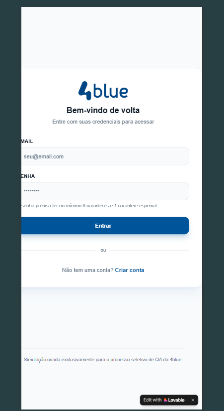
### Resultado esperado

É esperado que a página exiba corretamente todos os campos, bem como seus respectivos títulos, na tela de qualquer dispositivo.

___

# Bug #02: Mensagem de conta inválida quando os campos estão vazios

| **Descrição**  | Ao entrar com os campos e-mail e senha vazios, o sistema tenta realizar login normalmente |
| -------------- | ----------------------------------------------------------------------------------------- |
| **Severidade** | Baixo                                                                                     |
| **Prioridade** | Baixo                                                                                     |
### Resultado atual

Ao entrar com os campos e-mail e senha vazios, o sistema envia a requisição de login com as informações vazias, o que é uma requisição desnecessária ao servidor.

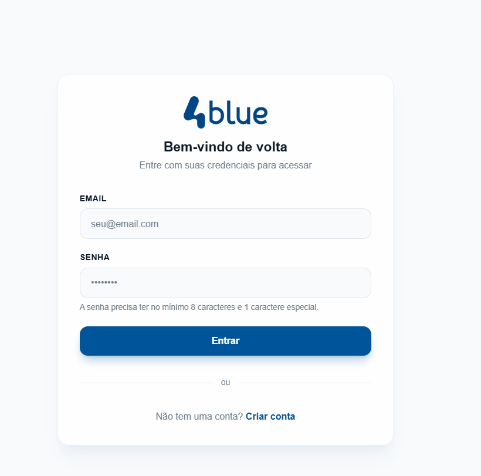
### Resultado esperado

Ao entrar com os campos e-mail e senha vazios, é esperado que a página sinalize que os campos estão vazios, preferencialmente com um aviso pouco intrusivo, conforme exemplo:

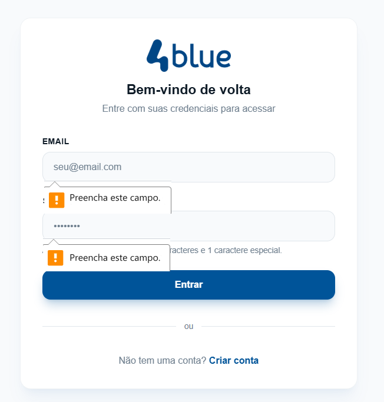

___

# Bug #03: Grafia errada da palavra 'e-mail'

| **Descrição**  | A palavra 'e-mail' não segue o padrão correto da língua portuguesa. |
| -------------- | ------------------------------------------------------------------- |
| **Severidade** | Baixo                                                               |
| **Prioridade** | Baixo                                                               |
### Resultado atual

O campo é descrito com a grafia "email".

### Resultado esperado

De acordo com o vocabulário ortográfico da língua portuguesa (VOLP) a grafia correta é e-mail.

___
# Bug #04: Campo e-mail não valida o formato do seu conteúdo

| **Descrição**  | Não há validação do texto digitado no campo e-mail. |
| -------------- | --------------------------------------------------- |
| **Severidade** | Baixo                                               |
| **Prioridade** | Médio                                               |
### Resultado atual

Não há validação do formato, permitindo que o usuário digite qualquer texto.

### Resultado esperado

É esperado que um aviso seja exibido caso o usuário não preencha corretamente as informações do campo.

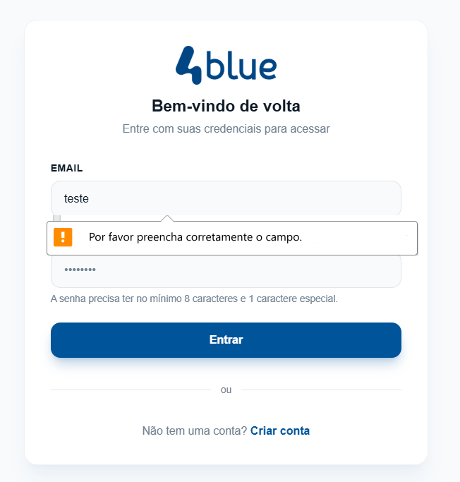

---

# Bug #05: Descrição irrelevante no campo senha

| **Descrição**  | O campo *senha* contém uma descrição que é relevante apenas no momento de criação de senha, e não no login |
| -------------- | ---------------------------------------------------------------------------------------------------------- |
| **Severidade** | Baixo                                                                                                      |
| **Prioridade** | Baixo                                                                                                      |
### Resultado atual

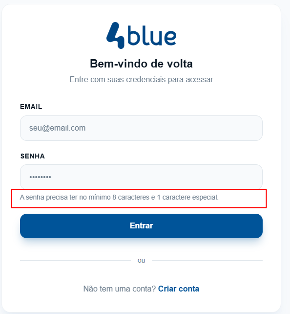

---
# Bug #06: Campo *senha* não valida os requisitos mínimos

| **Descrição**  | No momento de criação de uma nova conta, o sistema não valida se a senha digitada pelo usuário atende as regras de senha impostas. |
| -------------- | ---------------------------------------------------------------------------------------------------------------------------------- |
| **Severidade** | Crítico                                                                                                                            |
| **Prioridade** | Alto                                                                                                                               |
### Resultado atual

O sistema permite a entrada de qualquer senha, sem nenhuma validação.

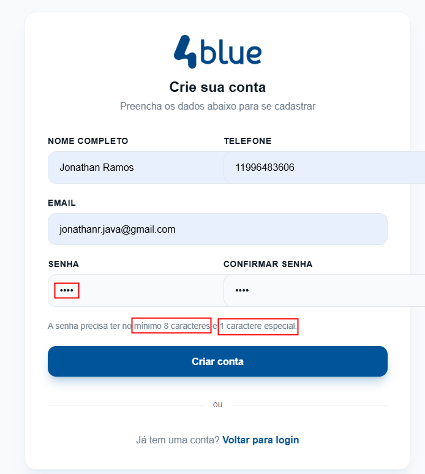

### Resultado esperado

Espera-se que o sistema valide o conteúdo da senha durante a digitação ou antes do usuário clicar em **Criar conta**. Essa informação precisa ser exibida ao usuário para que ele entenda o que falta na criação de sua senha, conforme a sugestão:

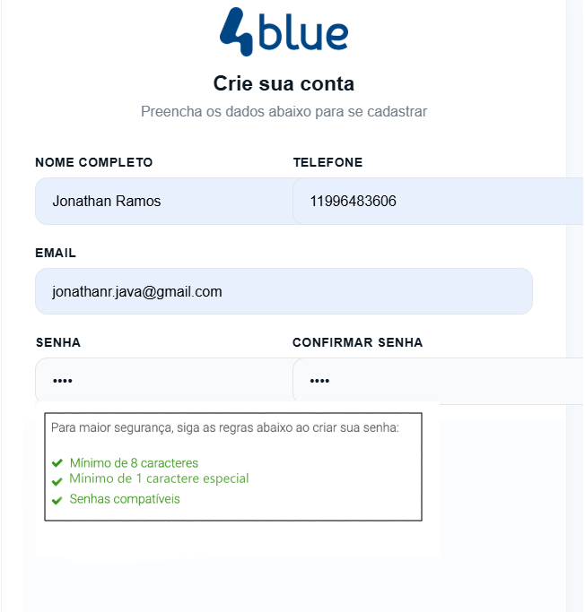

---

# Bug #07: Itens do formulário não estão devidamente alinhados.

| **Descrição**  | Os campos do formulário de cadastro não estão alinhados corretamente, sobressaindo da área correspondente ao formulário. |
| -------------- | ------------------------------------------------------------------------------------------------------------------------ |
| **Severidade** | Médio                                                                                                                    |
| **Prioridade** | Alto                                                                                                                     |
### Resultado atual

Os campos **Telefone** e **Confirmar senha** saltam para fora do formulário.

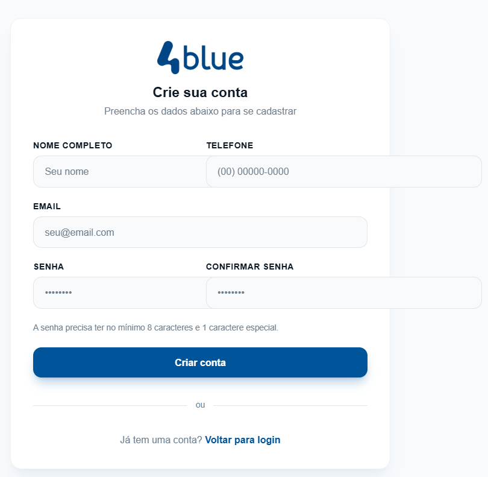

### Resultado esperado

Os campos deveriam estar alinhados corretamente na vertical, conforme a sugestão:

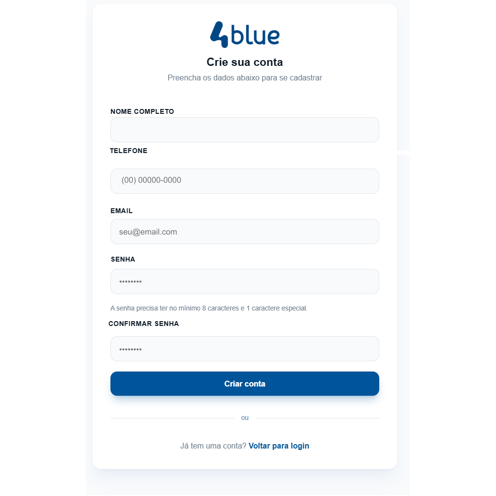

---
# Bug #08: Campo e-mail exibe texto em inglês

| **Descrição**  | Ao digitar algum texto no campo e-mail e colocar o mouse sobre o campo, o campo exibe uma mensagem de validação em inglês. |
| -------------- | ------------------------------------------------------------------------------------------------------------------ |
| **Severidade** | Baixo                                                                                                              |
| **Prioridade** | Baixo                                                                                                              |
### Resultado atual

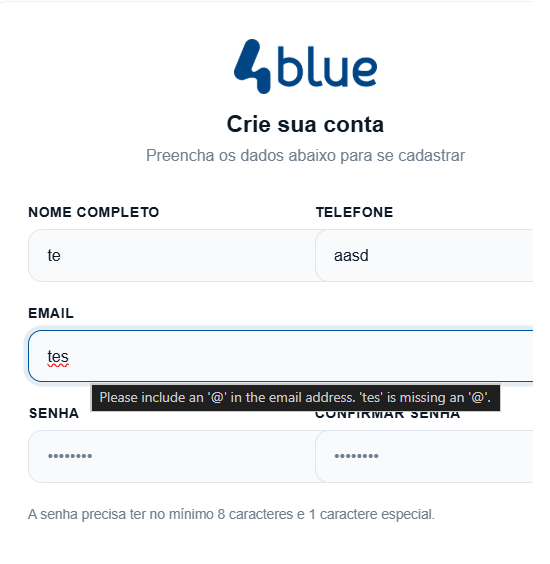

### Resultado esperado

É esperado que a mensagem seja no mesmo idioma do usuário e que a mensagem seja exibida sem a necessidade de colocar o mouse sobre o campo. Pode-se seguir a mesma lógica da sugestão do bug #04:

---

# Bug #09: Campo telefone não é formatado 

| **Descrição**  | O campo telefone não é formatado com os parênteses para o DDD nem hífen para separação dos números. |
| -------------- | --------------------------------------------------------------------------------------------------- |
| **Severidade** | Baixo                                                                                               |
| **Prioridade** | Médio                                                                                               |
### Resultado atual

O campo não é formatado.

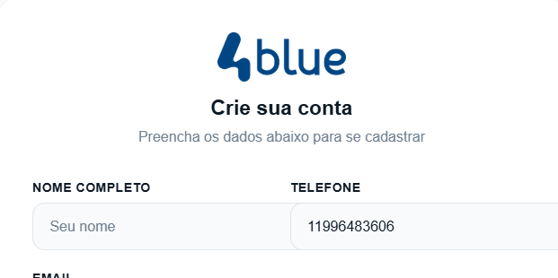
### Resultado esperado

É esperado que haja a separação entre DDD e os grupos de número.
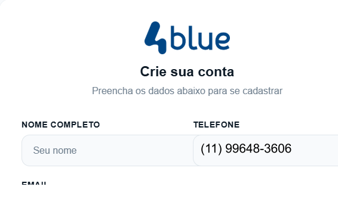

---

# Bug #10: Campo telefone aceita não é validado.

| **Descrição**  | Não há validação do número digitado, permitindo a inclusão de mais caracteres do que o necessário, além de letras e símbolos. |
| -------------- | -------------------------------------------------------------------------------------------------------------------------- |
| **Severidade** | Alto                                                                                                                       |
| **Prioridade** | Alto                                                                                                                       |
### Resultado atual

O campo permite qualquer entrada.

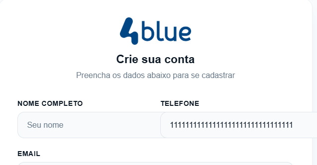

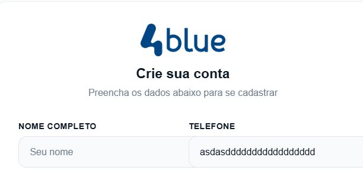
### Resultado esperado

É esperado que o campo não permita mais de 11 dígitos e que não permita a inclusão de qualquer outro valor além de número.

---

# Bug #11: Senha do usuário não é confirmada

| **Descrição**  | O campo **senha** e **confirmar senha** não são validados, permitindo que o usuário digite senhas diferentes nos dois campos. |
| -------------- | ----------------------------------------------------------------------------------------------------------------------------- |
| **Severidade** | Crítico                                                                                                                       |
| **Prioridade** | Alto                                                                                                                          |
### Resultado atual

O campo permite senhas diferentes.

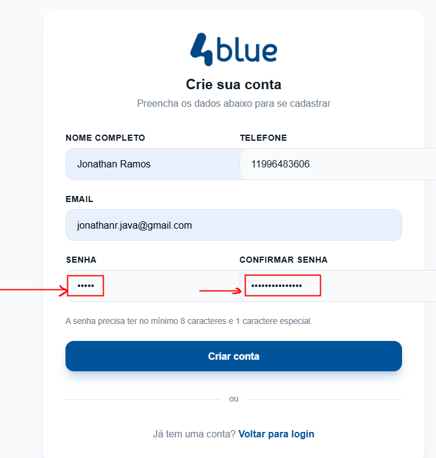

### Resultado esperado

É esperado que seja exibido um alerta para que o usuário corrija a senha repetida.
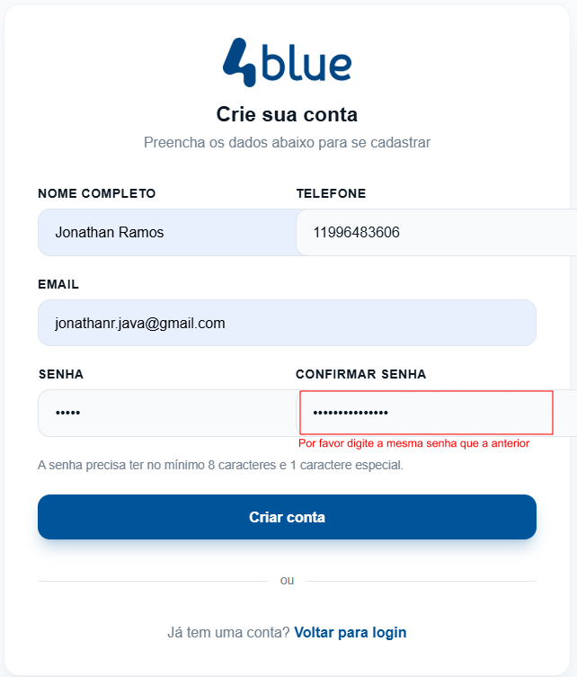

---

# Bug #12: Formulário de cadastro não destaca os campos obrigatórios

| **Descrição**  | Não há nenhuma informação a respeito de quais campos são necessários para que o usuário prossiga com o cadastro. |
| -------------- | ---------------------------------------------------------------------------------------------------------------- |
| **Severidade** | Baixo                                                                                                            |
| **Prioridade** | Baixo                                                                                                            |
### Resultado atual

O formulário não destaca quais campos são obrigatórios no momento do cadastro.

### Resultado esperado

É esperado que o usuário seja informado a respeito de quais campos são obrigatórios.
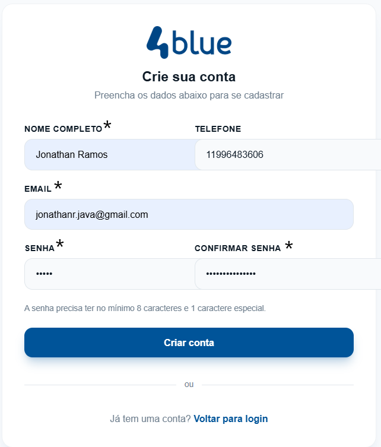

---

# Bug #13: Botão *sair* não corresponde ao estado do usuário

| **Descrição**  | O texto do botão ao realizar um novo cadastro dá a entender que o usuário já está conectado. |
| -------------- | -------------------------------------------------------------------------------------------- |
| **Severidade** | Baixo                                                                                        |
| **Prior**      | Baixo                                                                                        |
### Resultado atual

O botão **Sair da conta** indica que o usuário já está conectado.

### Resultado esperado

Como o usuário ainda precisa fazer login, é esperado que o botão retorne o usuário a página de login e que o contexto do botão indique essa ação.

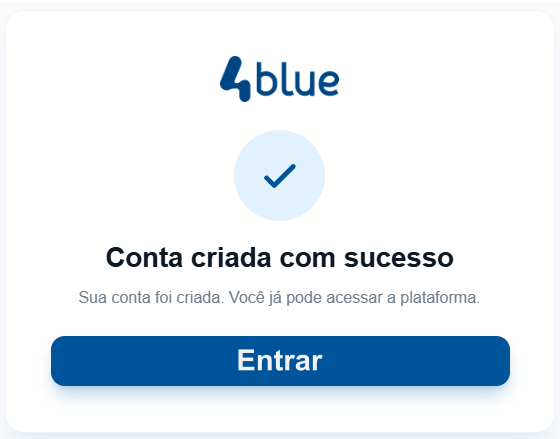

---

# Bug #14: Erro de Login

| **Descrição**  | Ao realizar o login com uma conta previamente cadastrada, é exibida uma mensagem de erro ao usuário. |
| -------------- | ---------------------------------------------------------------------------------------------------- |
| **Severidade** | Médio                                                                                                |
| **Prior**      | Alto                                                                                                 |
### Resultado atual

Uma mensagem (toast) de erro é exibida, embora a mensagem de sucesso também seja exibida.

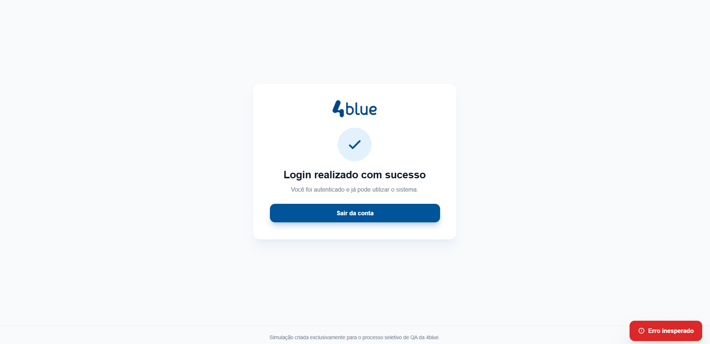

### Resultado esperado

Embora a página exiba que o login foi realizado com sucesso, é necessário se a mensagem de erro trata-se de um erro durante o processo ou se é apenas uma mensagem de alerta tratada como erro, para que ou o login seja corrigido (se de fato há um erro) ou a mensagem tratada (em caso de alerta)

---

# Bug #15: Senha do usuário é visível no console

| **Descrição**  | É possível identificar todos os dados de login do usuário através do terminal. |
| -------------- | ------------------------------------------------------------------------------ |
| **Severidade** | Crítico                                                                        |
| **Prior**      | Alto                                                                           |
### Resultado atual

Ao clicar em F12 e acessar a aba Console, qualquer usuário do computador pode ver a senha do usuário.
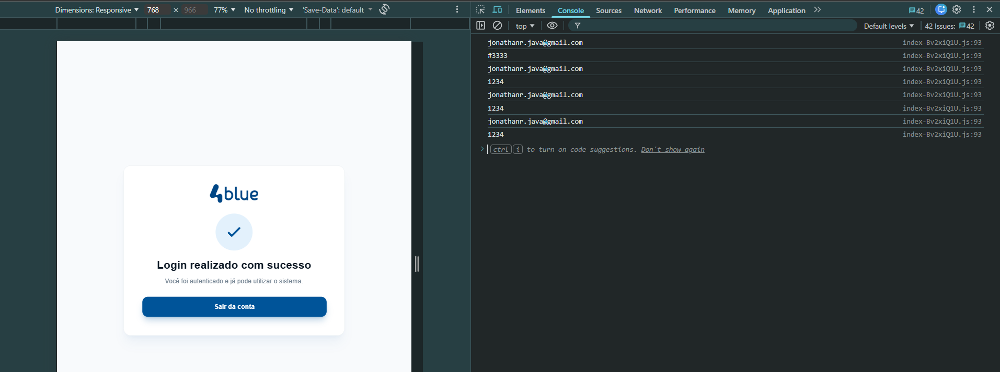
### Resultado esperado

Essa informação deve ser mascarada para que usuários maliciosos não tenham acesso.

---

